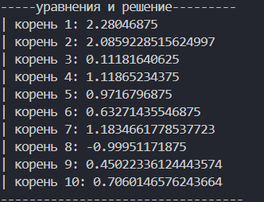
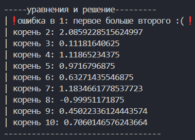

# дз для численных методов

made by @lokmie

```python
// импорт библиотеки для функций, предназначенных для решения математических проблем
import math

// задаем класс для обработки выражений, инициализируем функцию, погрешность и максимальное количество итераций для посика корня
class EquationSolver:
    def __init__(self, function, tolerance=1e-5, max_iterations=10):
        self.function = function
        self.tolerance = tolerance
        self.max_iterations = max_iterations

    def bisection_method(self, a, b):
        // имеют ли одинаковый знак?
        if self.function(a) * self.function(b) >= 0:
            raise ValueError("первое больше второго :(")

        // цикл для максимального количества итераций
        for i in range(self.max_iterations):
            // ищем среднюю точку
            c = (a + b) / 2
            // близко к 0?
            if abs(self.function(c)) < self.tolerance:
                return c // возвращем корень
            // корень между а и с?
            elif self.function(a) * self.function(c) < 0:
                b = c // сужаем к а, с
            else:
                a = c // если нет, то с к б
        // срзнач, если не найден корень
        return (a + b) / 2

// в массиве уравнения, у которых нужно найти корень
equations = [
    (lambda x: x - 1.25 * math.log(x) - 1.25, 2.2, 2.4),  # 1. x – 1.25ln(x) – 1.25 = 0 (2.2;2.4)
    (lambda x: x**2 - 5 * math.sin(x), 1.57, 3.14),       # 2. x^2 – 5sin(x) = 0 (1.57;3.14)
    (lambda x: math.exp(x) - 10 * x, 0, 1),               # 3. e^x – 10x = 0 (0;1)
    (lambda x: 0.1 * x**2 - x * math.log(x), 1, 2),       # 4. 0.1x^2 – x ln(x) = 0 (1;2)
    (lambda x: 0.1 * math.sin(x) + x**3 - 1, 0.8, 1.0),   # 5. 0.1sin(x) + x^3 – 1 = 0 (0.8;1.0)
    (lambda x: math.exp(x) - x - 1.25, 0.618, 0.667),     # 6. e^x – x – 1.25 = 0 (0.618;0.667)
    (lambda x: x**2 * math.cos(2 * x) + 1, 0, math.pi/2), # 7. x^2cos(2x) + 1 = 0 (0;π/2)
    (lambda x: x**3 + x**2 + x + 1, -2, 1),               # 8. x^3 + x^2 + x + 1 = 0 (-2;1)
    (lambda x: 2 * x - math.cos(x), 0, math.pi/2),        # 9. 2x – cos(x) = 0 (0;π/2)
    (lambda x: math.tan(x) - (x + 1)/2, 0, math.pi/4)     # 10. tg(x) – (x+1)/2 = 0 (0;π/4)
]

// для более красивого вывода :)
print("\n\n-----уравнения и решение---------")

// отправляем в класс, выводим результат здесь
for i, (equation, a, b) in enumerate(equations, start=1):
    solver = EquationSolver(equation)
    try:
        root = solver.bisection_method(a, b)
        // основной вывод
        print(f"| корень {i}: {root}")
    except ValueError as e:
        // если ошибка, выводим
        print(f"|❗ошибка в {i}: {e}❗")

print("----------------------------------\n\n")

```

## вывод



### вывод с ошибкой


